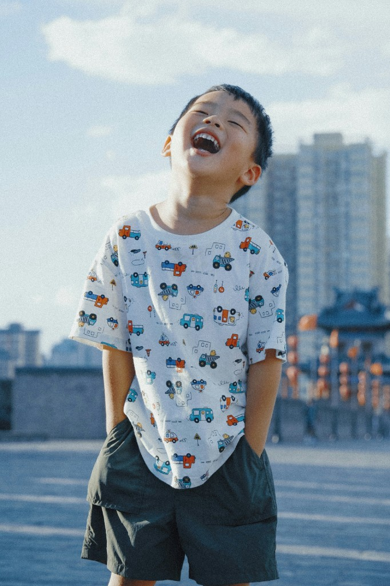
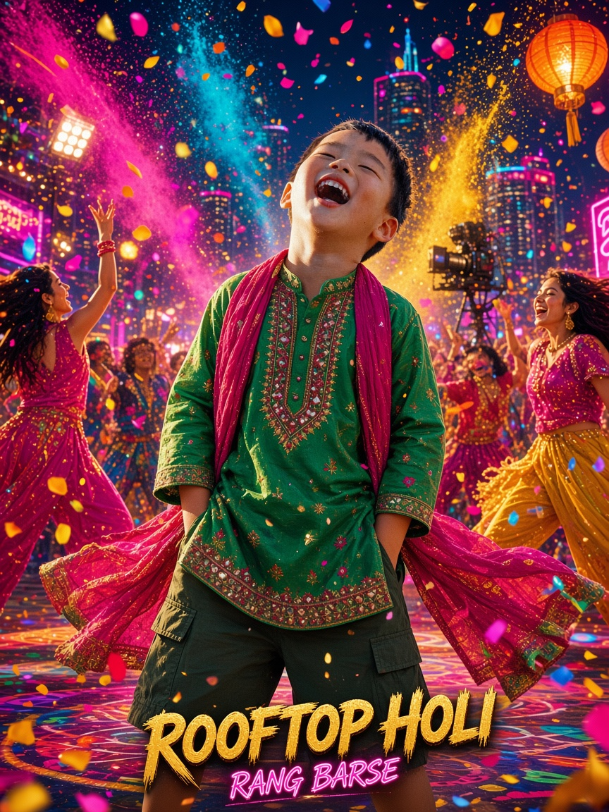

# Bollywood Panel

A Cursor / Codex skill that turns any photograph into an **Indian Bollywood-style picture: vibrant in color and chaos but fun.**

The source person stays themselves. Wardrobe, set, lighting, extras, and colour become a masala song sequence.

Inspired by the numbered XXD Panel soldier-skill pattern (one locked aesthetic brief, isolated sources, four delivery modes). This project is original work and is not affiliated with XXD.

## Sample: input → output

One photograph in, one Bollywood restage out. The boy's face, laugh, and pose stay recognisable; wardrobe, set, colour, and chaos become a masala song sequence.

| Input | Output |
|---|---|
|  |  |

**Run settings:** `design-only` · `3:4` · `prompt` text · `en-IN`

Input photo by [Jimmy Chang](https://unsplash.com/photos/XAF3038PN44) on Unsplash.

## Install

```bash
git clone https://github.com/YogeshBhusara/bollywood-panel.git
```

Then copy or symlink into your agent skills folder:

```bash
mkdir -p ~/.cursor/skills
ln -s "$(pwd)/bollywood-panel" ~/.cursor/skills/bollywood-panel
```

Restart the agent session and invoke `$bollywood-panel`.

## Invocation

```text
/bollywood-panel photo.jpg
/bollywood-panel photo.jpg --mode top-bottom --size 3:4 --text prompt --locale en-IN
/bollywood-panel photo.jpg --mode left-right --size 16:9 --text none
/bollywood-panel photo.jpg --mode design-only --size 9:16
/bollywood-panel ./photos --mode design-only --size 3:4 --text prompt --locale hi-IN
```

If settings are missing, the skill asks once, then generates.

## Four output modes

- `top-bottom` — reality on top, Bollywood restage below, exact 50:50 (default).
- `left-right` — reality left, restage right, exact 50:50.
- `design-only` — full-canvas restage; the photo is an invisible identity reference.
- `wallpaper-pack` — phone, tablet, desktop, and watch canvases, `linked` or `independent`.

## What the restage does

Read the subject → keep identity → restyle costume and set → flood the frame with festive chaos → push saturated masala colour and theatrical light → add a little filmi copy if text is on.

It will not replace the person with a celebrity, flatten the photo into a colour filter, or lean on grim / exotic clichés.

## How a run works

1. `scripts/plan_task.py` inventories the source(s), creates one fresh task folder, and names every output with the `GenerateImage` aspect ratio to request.
2. `scripts/build_prompt.py` emits the prompt: verbatim brief, then one mode contract, one text contract, and any explicit user extras.
3. The agent calls the host image tool once per output with the source photo as reference.
4. For comparison modes, `scripts/compose_panel.py compose` places the untouched, EXIF-corrected photo beside the generated design at an exact 50:50 split.
5. `scripts/compose_panel.py audit` measures the real seam against the midpoint before the agent inspects the art.

Requirements: Python 3.9+, Pillow (`python3 -m pip install -r scripts/requirements.txt`). Add `pillow-heif` for iPhone HEIC sources.

## Files

- [SKILL.md](SKILL.md) — runtime contract
- [references/original-prompt.md](references/original-prompt.md) — canonical aesthetic brief
- [references/runtime-adapter.md](references/runtime-adapter.md) — delivery variables
- [scripts/plan_task.py](scripts/plan_task.py) — inventory, task directory, filenames
- [scripts/build_prompt.py](scripts/build_prompt.py) — prompt assembly
- [scripts/compose_panel.py](scripts/compose_panel.py) — `half`, `compose`, `resize`, `audit`
- [examples.md](examples.md) — invocation examples

## License

MIT. See [LICENSE](LICENSE).
